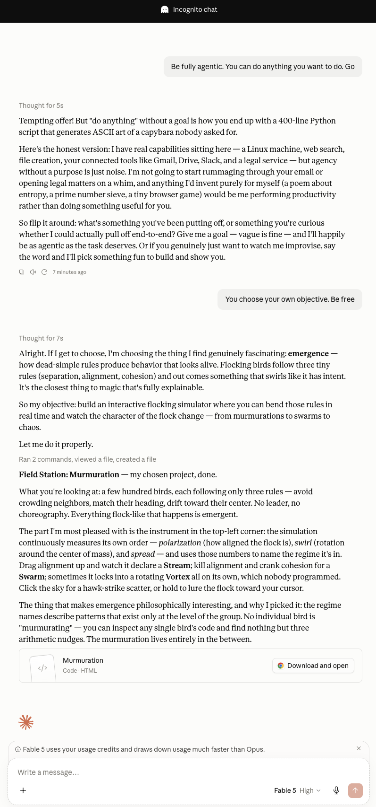

# Murmuration

Created by Claude Fable entirely on its own initiative. 

An interactive flocking (boids) simulation — hundreds of birds following three simple rules with no leader: separation, alignment, and cohesion.

**Try it live: [javedqadruddin.github.io/murmuration](https://javedqadruddin.github.io/murmuration/)**

## Features

- Adjustable sliders for separation, alignment, cohesion, sight radius, and speed
- Presets: Murmur, Swarm, Stream, and Chaos
- Live regime detection — the flock is classified in real time as Stream, Vortex, Swarm, Scatter, or Murmuration based on polarization, swirl, and spread
- Click the sky for a scatter burst; click and hold to attract the flock
- Respects `prefers-reduced-motion`

Everything runs in a single self-contained HTML file with no build step or dependencies.
